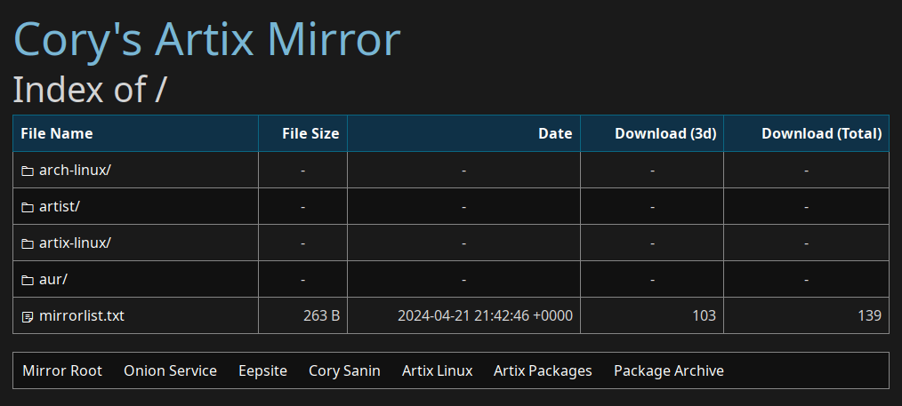

# Swanky Index

[](https://github.com/CorySanin/swankyindex/blob/master/LICENSE)
[](https://github.com/CorySanin/swankyindex/releases/latest)
[](https://github.com/CorySanin/swankyindex/pkgs/container/swankyindex)
[](https://hub.docker.com/r/corysanin/swankyindex)


A souped-up fancyindex alternative with download stats.



[Visit live instance](https://mirror.sanin.dev/)

## Features

- Directory listing
- Tracks download counts
- Flexible theming/templating
- Rest API for optional client-side rendering
- Download multiple files as a zipped archive
- Highly configurable but with good defaults in mind
- Not vibe-coded

## Configuration

Below are the available settings with their default values. Nearly all settings can be set with environment variables. Default config location is `data/config.yml` but can be overridden with environment variable `CONFIG`.

```yaml
port: 8080 # ENV:PORT - What port to listen on.
title: "Index of " # ENV:TITLE - Title tag prefix
storage: data/downloadcount.db # ENV:STORAGE - DB storage location
directory: /srv/http/ # ENV:DIRECTORY - Root of the index
styles: styles.css # ENV:STYLES - Relative path from static/css/ to a custom stylesheet
icons: true # ENV:ICONS - Whether to show icons next to files based on their file extensions
showDownloads: true # ENV:SHOWDOWNLOADS - Whether to show download counts to public visitors
showDotfiles: false # ENV:SHOWDOTFILES - Whether to show dotfiles in directory listings
showSymlinks: true # ENV:SHOWSYMLINKS - Whether to show symlinked files and directories
enableJs: true # ENV:ENABLEJS - Enables client-side scripts, for navigation and zip downloads
enableZipDownloads: false # ENV:ENABLEZIPDOWNLOADS - Allow multi-file downloads with JS
heading: | # ENV:HEADING - HTML to appear before the index. %path% becomes the path name.
    <h1>Index of <span id=\"path\">%path%</span></h1>
footer: "" # ENV:FOOTER - HTML to appear after the index. %path% becomes the path name.
ignore: [] # List of regular expressions. Files that match will be hidden from the index.
```

## Building

### Static Resources

Swanky Index relies on CSS and Javascript in the `static-src` directory.

```
cd static-src
npm install
npm run build
```

### Server

In the project root:

```
CGO_ENABLED=1 go build cmd/swankyindex/main.go
./main
```
